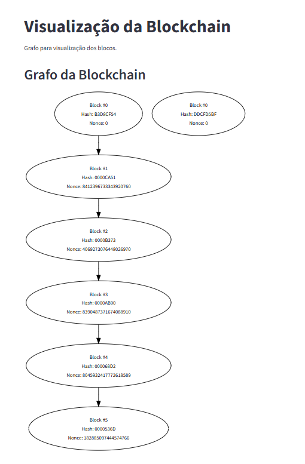

# Basic Blockchain Implementation in Python

### Description

Basic implementation of a blockchain in Python, just for study.

#### Features:
 - Single node
 - Block generation
 - Block mining
 - Block validation and verification
 - Support for any type of data in the payload
 - Block visualization with [Streamlit](https://streamlit.io/) and [Graphviz](https://graphviz.org/)
 - Records saved using [MongoDB](https://www.mongodb.com/pt-br)

#### Upcoming
- [ ] Transation support
- [ ] Others ...

## Installation

### Python

Python Installation: [Link](https://www.python.org/)

Version: 3.10+

#### Commands:

```Recommendation: Use Virtualenv```
```
# Create and activate your virtualenv

python -m pip install -r requirements.txt
```


### Docker

Create and configure ```.env``` file using ```.env.sample```

Docker installation: [Link](https://www.docker.com/)

```
docker compose up --build
```

### Run

Open the terminal and pass the positional parameters for difficulty and number of blocks for creation/mining respectively

```
python main.py 4 10
```
Now, RUN streamlit
```
streamlit run app.py
```

### Visualization
Blockchain visualization

